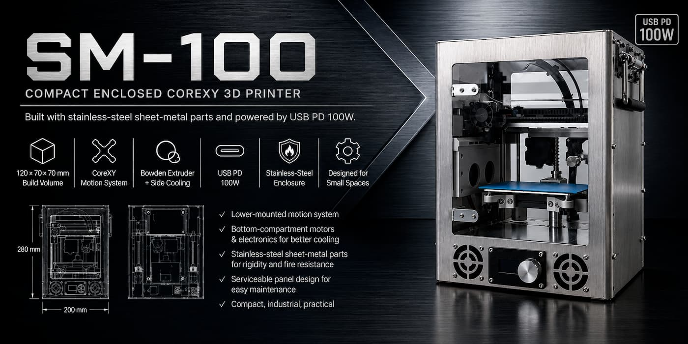
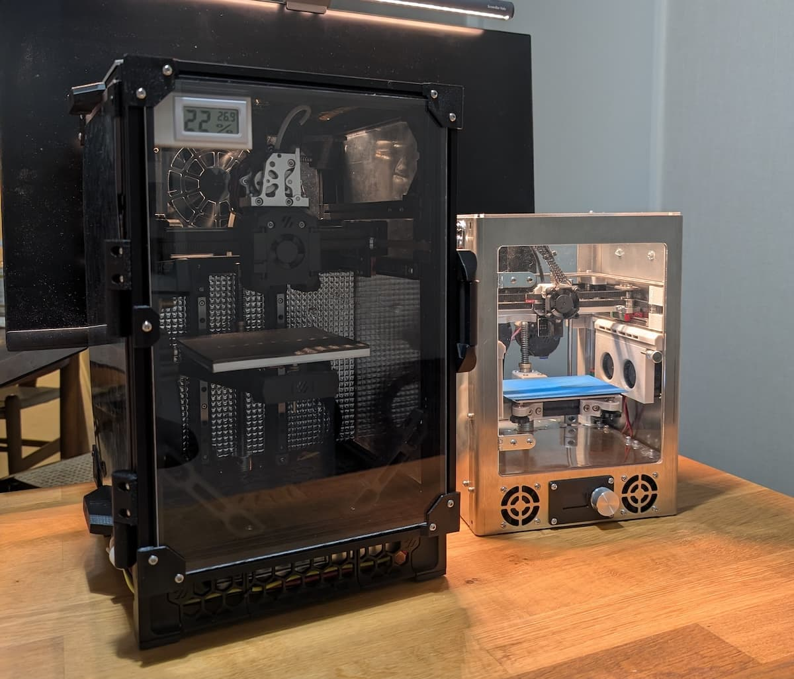
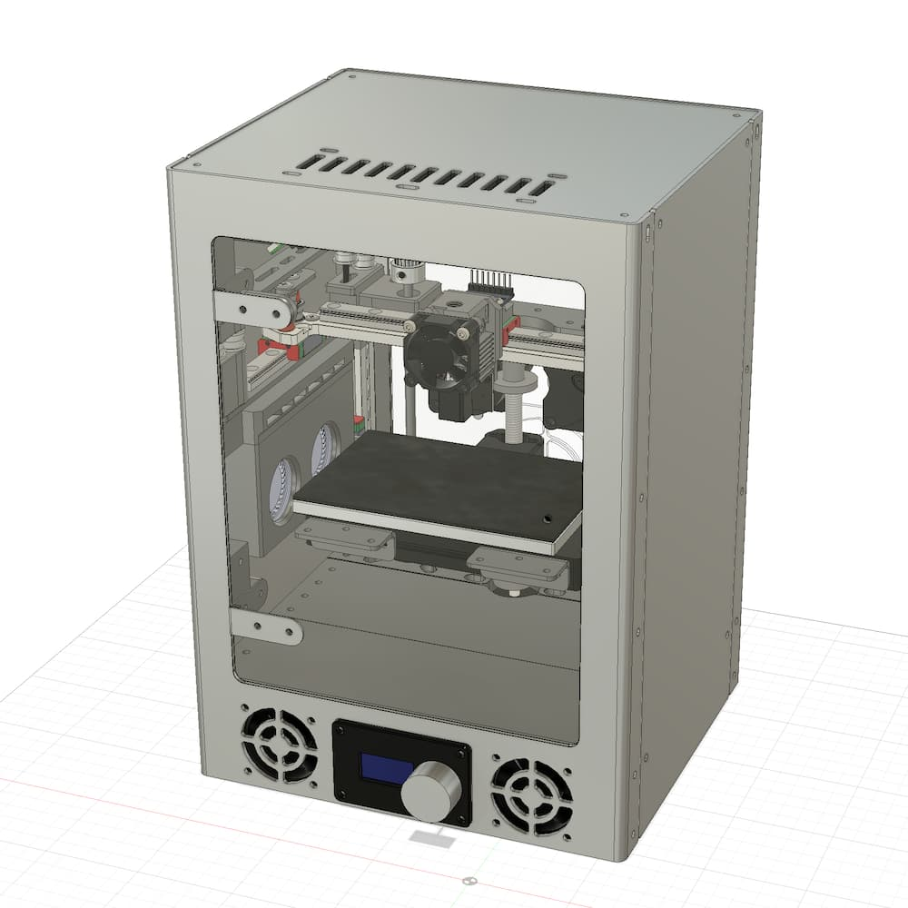
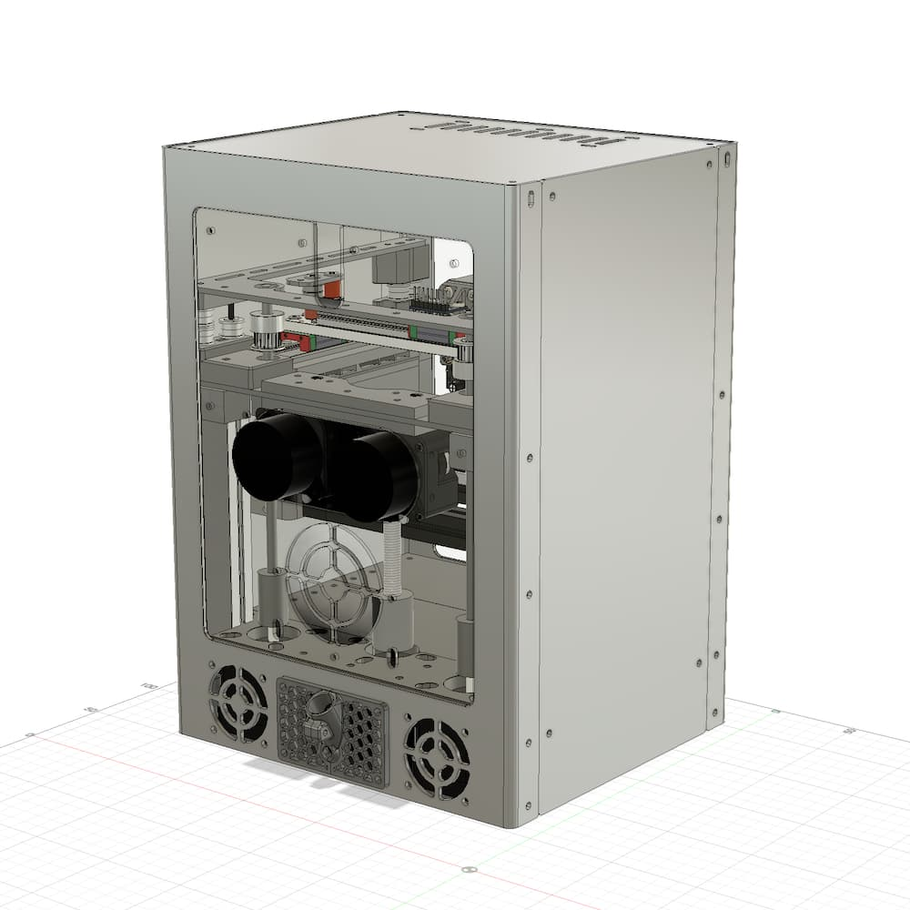

SM-100 is a compact CoreXY 3D printer featuring a 120x70x70 mm build volume within a 200x180x280 mm footprint.
Designed for compact, practical use in small apartments, it utilizes a stainless-steel sheet-metal chassis and runs entirely on 100W USB-PD power.

## But Why?

Living in a small Tokyo apartment with a pet dog makes finding a safe, permanent spot for a 3D printer a challenge.

My previous machine, a Bambu Lab A1 Mini, is an excellent printer. However, as a bed-slinger, it requires more operating space than its footprint suggests.
An open-frame printer also raised two concerns for my living situation: it could be reached by my dog, creating a risk of accidental contact with moving parts, and it made it difficult to vent VOCs and odors outdoors.

SM-100 was designed to solve these issues. Drawing from my experience building compact 3D printers like the [Fraxinus 00w2](https://fraxinus.jp/en/docs/micro-printers/#fraxinus00w2), [Fraxinus 00cw](https://fraxinus.jp/en/docs/community/#fraxinus00cw), [Fraxinus 00tcw](https://x.com/c_bata_/status/1891012343326261727), and [Voron 0.2](https://github.com/voronDesign/Voron-0), I focused on three design priorities:

1. **Ultra-compact footprint**: Achieved by using a Bowden extruder, side-mounted part cooling, and external USB-PD power to eliminate the need for an internal PSU.
2. **Thermal Management**: Excessive stepper motor heat can reduce torque and shorten motor life. Placing the A/B/Z motors and electronics in a dedicated bottom compartment allows them to be cooled by front intake fans.
3. **Fire Safety**: For a machine intended for home use, fire safety is a critical consideration. Using stainless-steel sheet metal for the main structure helps reduce fire risk compared with printed parts, while still providing excellent rigidity.

Below is a size comparison with the Voron V0.

## Design Highlights

**Lower-Mounted Motion System** — Unlike traditional CoreXY designs, the A/B motors are located in the bottom compartment, driving the gantry via 5mm stainless-steel shafts. This lowers the center of gravity and allows the front intake fans to cool the motors, and electronics simultaneously without requiring extra airflow in the upper chamber.

**Bowden Extruder and Side-Mounted Cooling** — By using a Bowden setup and placing four 4020 part-cooling fans on either side of the print chamber, the toolhead remains extremely light.

**Sheet-Metal Chassis** — Stainless-Steel Sheet-Metal Construction — Compared with aluminum extrusion frames used in printers like the Voron V0, sheet metal provides comparable rigidity with a much thinner profile, enabling the SM-100's compact size. It also offers better fire resistance than printed enclosure parts.

**USB PD Power Delivery** — By running entirely on 100W USB-PD, the machine eliminates the bulky internal power supply, further reducing the overall footprint.

## CAD Files

| Front View | Rear View |
| ---------- | --------- |
|  |  |

The current CAD archive is available here:

- [CAD/SM-100.step.zip](./CAD/SM-100.step.zip)

The archive currently contains the main STEP file for the project.

> [!WARNING]
> **Experimental Release**: Some components (pulleys, belts, screws, motors, bearings, and sensors) are currently excluded from the CAD data to respect third-party redistribution licenses. Full assembly files and manuals are not yet available. Building this printer is currently considered a high-difficulty task.

Depending on community interest, I plan to provide:

- Complete assembly CAD files
- A full Bill of Materials (BOM)
- Detailed assembly instructions

## Current Status

SM-100 is currently a prototype and should be treated as experimental hardware. This repository serves as a design documentation release rather than a complete, ready-to-build consumer guide.

## Acknowledgements

This project was heavily inspired by the Fraxinus 00 series and the Fraxinus community. Specifically, the implementation of Bowden extrusion and USB-PD power in a compact enclosure was influenced by their innovative work.

Fraxinus community: [fraxinus.jp/en/](https://fraxinus.jp/en/)

## License

See the [LICENSE](./LICENSE) file for details.
